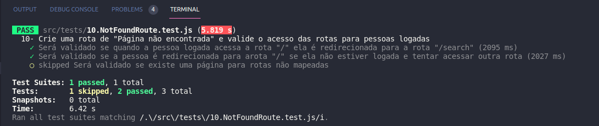
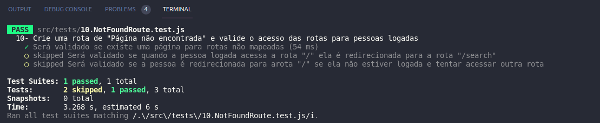
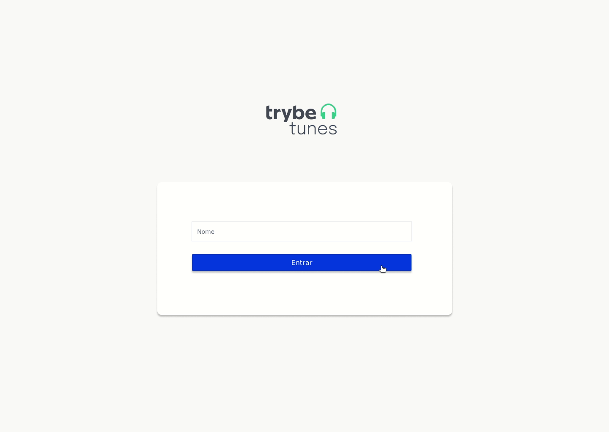
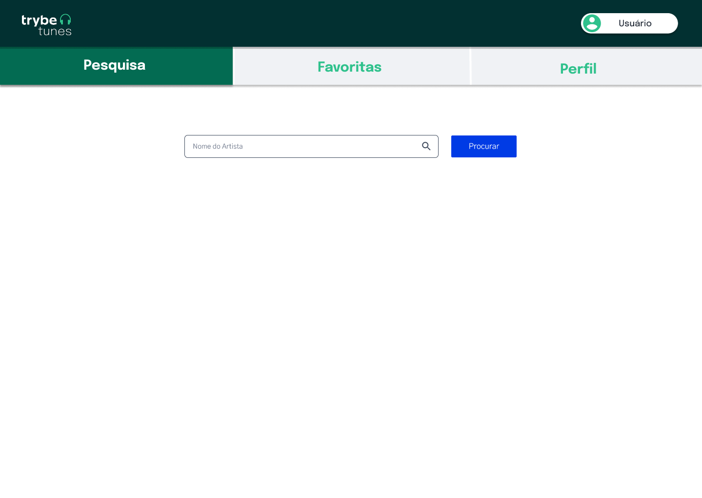
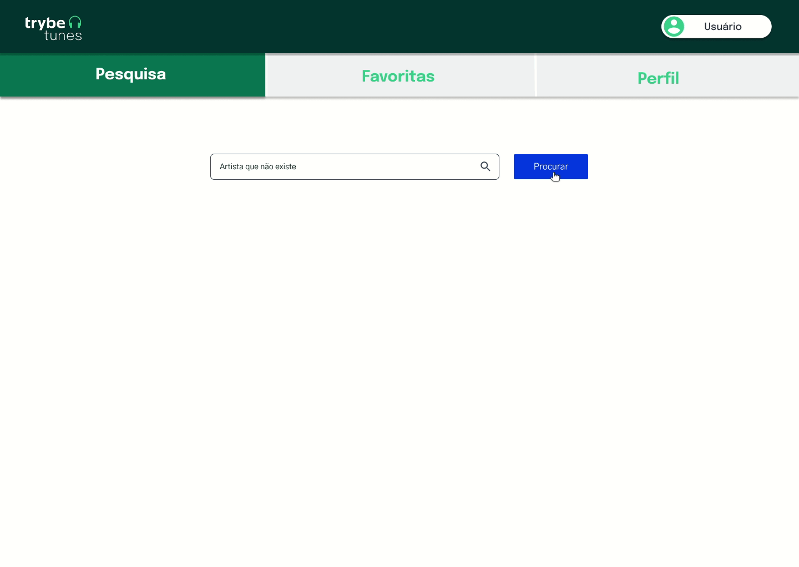
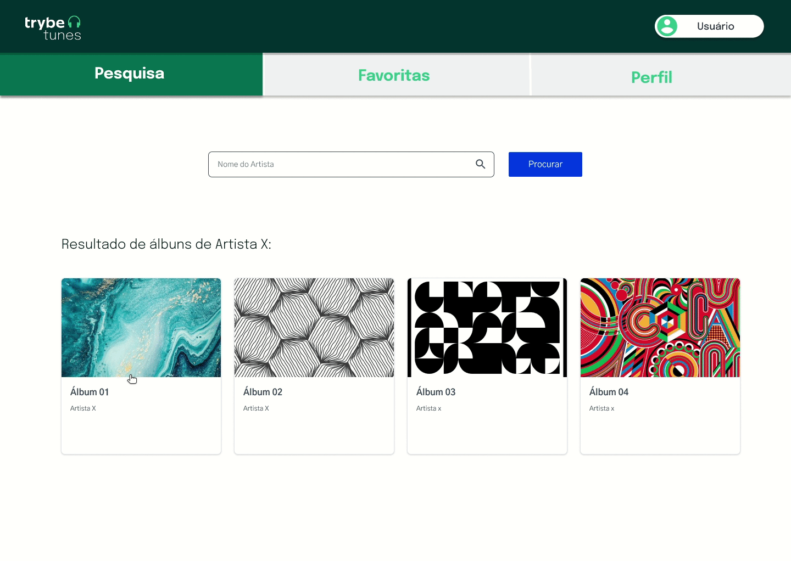
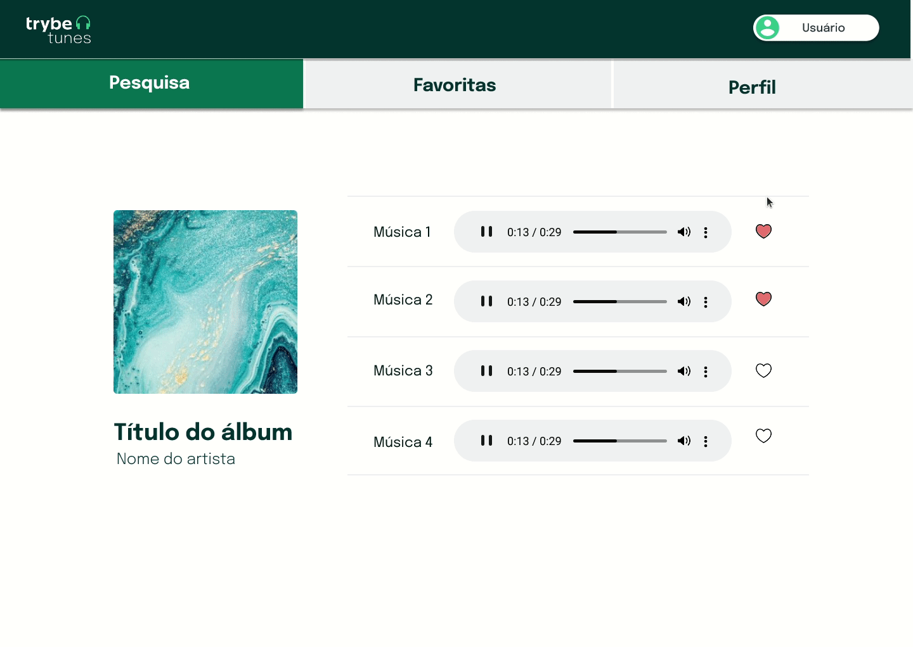
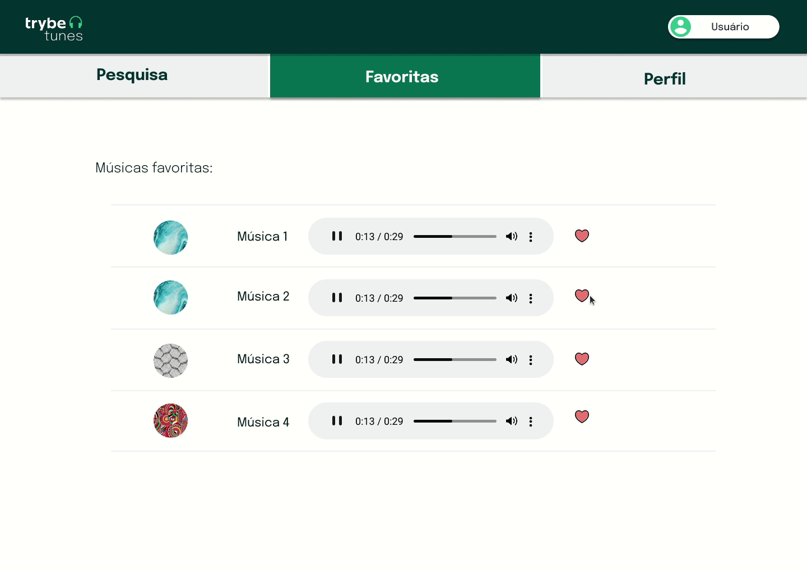
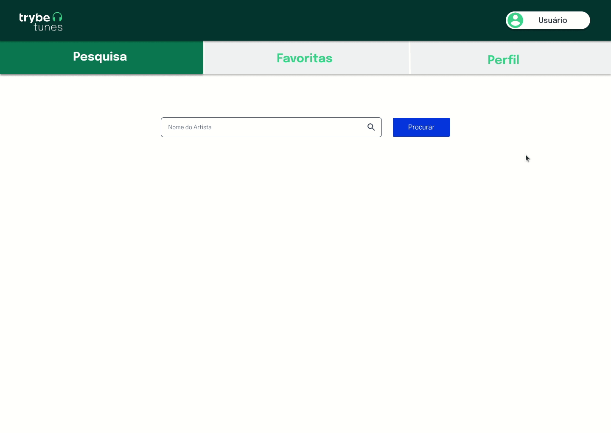
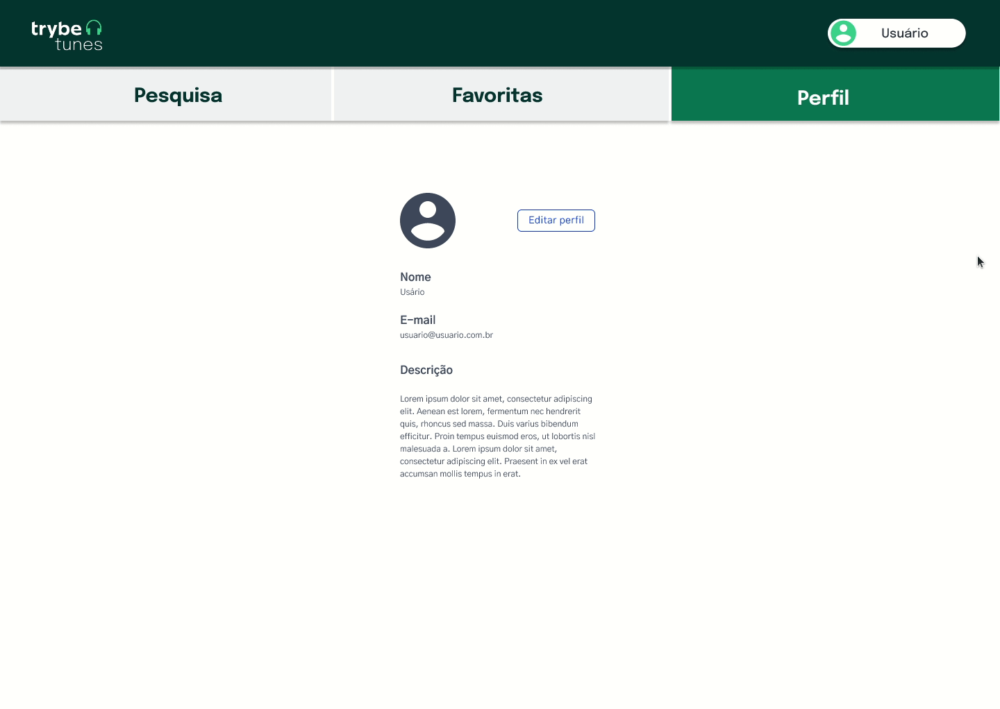

# Boas-vindas ao repositório do projeto Trybetunes!

Projeto de avaliação feito durante o curso da Trybe.

<details>
  <summary><strong>👨‍💻 O que deverá ser desenvolvido</strong></summary><br />

  Neste projeto você irá criar o TrybeTunes, uma aplicação capaz de reproduzir músicas das mais variadas bandas e artistas, criar uma lista de músicas favoritas e editar o perfil da pessoa usuária logada. Essa aplicação será capaz de:

  - Fazer login;
  - Pesquisar por uma banda ou artista;
  - Listar os álbuns disponíveis dessa banda ou artista;
  - Visualizar as músicas de um álbum selecionado;
  - Reproduzir uma prévia das músicas deste álbum;
  - Favoritar e desfavoritar músicas;
  - Ver a lista de músicas favoritas;
  - Ver o perfil da pessoa logada;
  - Editar o perfil da pessoa logada;

</details>

<details>
  <summary><strong>:memo: Habilidades</strong></summary><br />

Neste projeto, verificamos se você é capaz de:

- Fazer requisições e consumir dados vindos de uma `API`;

- Utilizar os ciclos de vida de um componente React;

- Utilizar a função `setState` de forma a garantir que um determinado código só é executado após o estado ser atualizado

- Utilizar o componente `BrowserRouter` corretamente;

- Criar rotas, mapeando o caminho da URL com o componente correspondente, via `Route`;

- Utilizar o `Switch` do `React Router`

- Criar links de navegação na aplicação com o componente `Link`;
</details>

# Orientações

<details>
  <summary><strong>Para acessar o projeto</strong></summary><br />

  1. Clone o repositório

  - Use o comando: `git clone git@github.com:priscilaSartori/project-trybetunes.git`.
  - Entre na pasta do repositório que você acabou de clonar:
    - `cd project-trybetunes`

  2. Instale as dependências

  - `npm install`.
  
  3. Inicie a aplicação
  
  - `npm start`.

</details>

<details>
  <summary><strong>🎛 Linter</strong></summary><br />

  Para garantir a qualidade do código, vamos utilizar neste projeto os linters `ESLint` e `StyleLint`.
  Assim o código estará alinhado com as boas práticas de desenvolvimento, sendo mais legível
  e de fácil manutenção! Para rodá-los localmente no projeto, execute os comandos abaixo:

  ```bash
    npm run lint
    npm run lint:styles
  ```

  ⚠️ **PULL REQUESTS COM ERROS DE LINTER NÃO SERÃO AVALIADAS.
  ATENTE-SE PARA RESOLVÊ-LAS ANTES DE FINALIZAR O DESENVOLVIMENTO!** ⚠️

  Em caso de dúvidas, confira o material do course sobre [ESLint e Stylelint](https://app.betrybe.com/course/real-life-engineer/eslint).
</details>

<details>
  <summary><strong>🛠 Testes</strong></summary><br />

  Neste projeto utilizamos a [React Testing Library (RTL)](https://testing-library.com/docs/react-testing-library/intro) para execução dos testes.

  Na descrição dos requisitos (logo abaixo) será pedido que seja feita a adição de atributos `data-testid` nos elementos _HTML_. Vamos a um exemplo para deixar evidente essa configuração: se o requisito pedir _"crie um botão e adicione o id de teste (ou `data-testid`) com o valor `my-action`, você pode escrever_:

  ```html
  <button data-testid="my-action"></button>
  ```

  ou

  ```html
  <a data-testid="my-action"></a>
  ```

  Ou seja, o atributo `data-testid="my-action"` servirá para o React Testing Library (RTL) identificar o elemento e, dessa forma, conseguiremos realizar testes focados no comportamento da aplicação.

  **ATENÇÃO!** Muito cuidado com os nomes especificados nos requisitos! O conteúdo deve ser exatamente igual ao texto descrito no requisito.

  Para verificar a solução proposta, você pode executar todos os testes localmente, basta executar:

  ```bash
  npm test
  ```

  ### Dica: desativando testes

  Especialmente no início, quando a maioria dos testes está falhando, a saída após executar os testes é extensa. Você pode desabilitar temporariamente um teste utilizando a função `skip` junto à função `it`. Como o nome indica, esta função "pula" um teste:

  ```js
  it.skip('Será validado se existe uma página para rotas não mapeadas', () => {
    renderPath('/not-found');

    expect(screen.getByText('Página não encontrada')).toBeInTheDocument();
  });
  ```
  

  Uma estratégia é pular todos os testes no início e ir implementando um teste de cada vez, removendo dele a função `skip`.

  Você também pode rodar apenas um arquivo de teste, por exemplo:

  ```bash
  npm test 01.LoginPage.test.js
  ```

  ou

  ```bash
  npm test 01.LoginPage
  ```

  Uma outra forma para driblar esse problema é a utilização da função `.only` após o `it`. Com isso, será possível que apenas um requisito rode localmente e seja avaliado.

  ```js
  it.only('Será validado se existe uma página para rotas não mapeadas', () => {
    renderPath('/not-found');

    expect(screen.getByText('Página não encontrada')).toBeInTheDocument();
  });
  ```
  

</details>

<details>
  <summary><strong>:convenience_store: Desenvolvimento </strong></summary><br />

  Nos últimos projetos, por mais que o app tenha sido desenvolvido utilizando múltiplos componentes, o que é uma boa prática, todas as funcionalidades eram acessadas ao mesmo tempo, no mesmo lugar, utilizando apenas uma URL (`localhost:3000`, normalmente). A medida que seus apps se tornarem maiores e mais complexos, isso se tornará inviável. Desta vez, as funcionalidades do app serão agrupadas e organizadas em rotas.

  Uma rota define o que deve ser renderizado na página ao abrí-la. Cada rota está associada a um caminho. O caminho é a parte da URL após o domínio (nome do site, de forma simplificada). Por exemplo, em `www.site.com/projetos/meu-jogo`, o caminho é `/projetos/meu-jogo`. Até agora, todos os apps React que você desenvolveu possuíam somente uma rota, a raíz (`/`).

  Outra diferença importante neste projeto em relação aos anteriores é que você irá consumir e enviar dados para APIs para pesquisar a banda ou artista, recuperar as músicas de cada álbum e salvar as músicas favoritas, além de editar as informações da pessoa logada. Dessa forma, você terá que lidar com requisições assíncronas e promises. Também deverá fazer uso dos métodos de ciclo de vida (lifecycle methods) e de estados para controlar o que é renderizado por seus componentes dependendo do momento em que as requisições se encontram.

  ### Como desenvolver

  Este repositório já contém um template com um App React criado. Após clonar o projeto e instalar as dependências, você deverá completar este template implementando os requisitos listados na seção [Requisitos](#requisitos).

  Também já existe no projeto um diretório `src/services` que contém os arquivos `favoriteSongsAPI.js`, `searchAlbumsAPI.js`, `userAPI.js` e `musicsAPI.js`. Esses arquivos serão responsáveis por lidar com as requisições simuladas que serão usadas durante o desenvolvimento. Entenda mais sobre eles abaixo:

  <details><summary><strong> <code>userAPI.js</code></strong></summary>

  O arquivo `userAPI.js` será utilizado para manipular as informações da pessoa logada, dentro dele estarão as funções para recuperar e atualizar as informações da pessoa usuária, além de criar um novo perfil. Todas essas funções simulam o funcionamento de uma API.

  - Para recuperar as informações da pessoa usuária, utilize a função `getUser`. Ela retornará um objeto com as informações da pessoa logada caso exista.
  **Atenção:** caso não encontre nenhuma informação da pessoa usuária, a API retornará um objeto vazio.

  - Para criar um novo perfil, utilize a função `createUser`, ela recebe como parâmetro o objeto que contém as informações da pessoa usuária. Esse objeto deverá conter a seguinte estrutura:

  ```javascript
  {
    name: '',
    email: '',
    image: '',
    description: '',
  }
  ```

  Para atualizar as informações da pessoa logada, utilize a função `updateUser`. Assim como a função anterior, ela também recebe um objeto com as informações que serão atualizadas, esse objeto deve conter a mesma estrutura do anterior.
  </details>

  <details><summary><strong> <code>searchAlbumsAPI.js</code></strong></summary>

  O arquivo `searchAlbumsAPI.js` contém uma função que faz uma requisição a uma API e retorna os álbuns de uma banda ou artista. Para essa função funcionar, ela recebe como parâmetro uma string, que deve ser o nome da banda ou artista. O retorno dessa função, quando encontra as informações, é um array com cada álbum dentro de um objeto.
  **Atenção:** caso não encontre nenhuma informação da banda ou artista, a API retornará um array vazio.
  </details>
  <details><summary><strong> <code>favoriteSongsAPI.js</code></strong></summary>

  O arquivo `favoriteSongsAPI.js` é responsável por manipular as informações das músicas favoritas. Nele há as funções `getFavoriteSongs`, `addSong` e `removeSong`, que recuperam, adicionam e removem músicas dos favoritos, respectivamente. Assim como nos arquivos anteriores, todas as funções simulam o funcionamento de uma API.

  A função `getFavoriteSongs` retorna um array com as músicas favoritas ou um array vazio, caso não haja nenhuma música.

  A função `addSong` recebe um objeto que representa a música que você quer salvar como favorita e adiciona ao array já existente das músicas que já foram favoritadas.

  A função `removeSong` também recebe um objeto que representa a música que você deseja remover da lista de músicas favoritas.

  **Atenção:** os objetos de música precisam ter a chave `trackId` para que as músicas sejam adicionadas e removidas corretamente.
  </details>
  <details><summary><strong> <code>musicsAPI.js</code></strong></summary>

  O arquivo `musicsAPI.js` contém a função `getMusics` que faz uma requisição a uma API e retorna os as músicas de um álbum. Ela recebe como parâmetro uma string, que deve ser o id do álbum. O retorno dessa função, quando encontra as informações, é um array onde o primeiro elemento é um objeto com informações do álbum e o restante dos elementos são as músicas do álbum.
  **Atenção:** caso não encontre nenhuma informação, a API retornará um array vazio.
  </details>
</details>

<details>
  <summary><strong>💻 Protótipo do projeto no Figma</strong></summary><br />

  Além da qualidade do código e do atendimento aos requisitos, um bom layout é um dos aspectos responsáveis por melhorar a usabilidade de uma aplicação e turbinar seu portfólio!

  Você pode estar se perguntando: *"Como deixo meu projeto com um layout mais atrativo?"* 🤔

  Para isso, disponibilizamos esse [protótipo do Figma](https://www.figma.com/file/pkocuFSMsqmUqvMUbsfcRp/%5BProjeto%5D%5BFrontend%5D-Trybetunes?node-id=0%3A1) para lhe ajudar !

  ⚠️ A estilização de sua aplicação não será avaliada nesse projeto, portanto esse protótipo é apenas uma **sugestão** e seu uso é **opcional**. Sinta-se à vontade para modificar o layout e deixá-lo do seu jeito.

</details>

# Requisitos

## 1. Crie as rotas necessárias para a aplicação

Você deve utilizar o `BrowserRouter` pra criar as rotas da sua aplicação e cada rota deverá renderizar um componente específico. Crie cada componente dentro da pasta `src/pages`, conforme o indicado abaixo:

<details><summary> Rota <code>/</code></summary>

- A rota `/` deve renderizar um componente chamado `Login`. Este componente deve ter uma `div` com o atributo `data-testid="page-login"` que envolva todo seu conteúdo;
</details>

<details><summary> Rota <code>/search</code></summary>

- A rota `/search` deve renderizar um componente chamado `Search`. Este componente deve ter uma `div` que envolva todo seu conteúdo e ter o atributo `data-testid="page-search"`;
</details>

<details><summary> Rota <code>/album/:id</code></summary>

- A rota `/album/:id` deve renderizar um componente chamado `Album`. Este componente deve ter uma `div` que envolva todo seu conteúdo e ter o atributo `data-testid="page-album"`;
</details>

<details><summary> Rota <code>/favorites</code></summary>

- A rota `/favorites` deve renderizar um componente chamado `Favorites`. Este componente deve ter uma `div` que envolva todo seu conteúdo e ter o atributo `data-testid="page-favorites"`;
</details>
<details><summary> Rota <code>/profile</code></summary>

- A rota `/profile` deve renderizar um componente chamado `Profile`. Este componente deve ter uma `div` que envolva todo seu conteúdo e ter o atributo `data-testid="page-profile"`;
</details>

<details><summary> Rota <code>/profile/edit</code></summary>

- A rota `/profile/edit` deve renderizar um componente chamado `ProfileEdit`. Este componente deve ter uma `div` que envolva todo seu conteúdo e ter o atributo `data-testid="page-profile-edit"`;
</details>

<details><summary> Para qualquer outra rota não mapeada</summary>

Para qualquer outra rota não mapeada, deve ser renderizado um componente chamado `NotFound`. Este componente deve ter uma `div` que envolva todo seu conteúdo e ter o atributo `data-testid="page-not-found"`;
</details><br />

<details>
  <summary><strong>O que será verificado</strong></summary><br />
  
  - A rota `/` é uma rota existente e que renderiza um componente com o `data-testid` com valor `page-login`;

  - A rota `/search` é uma rota existente e que renderiza um componente com o `data-testid` com valor `page-search`;

  - A rota `/album/:id` é uma rota existente e que renderiza um componente com o `data-testid` com valor `page-album`;

  - A rota `/favorites` é uma rota existente e que renderiza um componente com o `data-testid` com valor `page-favorites`;

  - A rota `/profile` é uma rota existente e que renderiza um componente com o `data-testid` com valor `page-profile`;

  - A rota `/profile/edit` é uma rota existente e que renderiza um componente com o `data-testid` com valor `page-profile-edit`;

  - Existe uma página para rotas não mapeadas e que renderiza um componente com o `data-testid` com valor `page-not-found`;
</details>

---

## 2. Crie um formulário para identificação
<details><summary>Dentro do componente <code>Login</code>, que é renderizado na rota <code>/</code>, crie um formulário para que a pessoa usuária se identifique com um nome:</summary>

- Você deve criar um campo para que a pessoa usuária insira seu nome. Este campo deverá ter o atributo `data-testid="login-name-input"`.

- Crie um botão com o texto `Entrar`. Este botão deverá ter o atributo `data-testid="login-submit-button"`.

- O botão para entrar só deve estar habilitado caso o nome digitado tenha 3 ou mais caracteres.

- Ao clicar no botão `Entrar`, utilize a função `createUser` da `userAPI` para salvar o nome digitado. A função `createUser` espera receber como argumento um objeto com as informações da pessoa: 
  
```javascript
createUser({ name: "Nome digitado" });
```

:bulb: *Obs:* Você verá nos requisitos mais a frente que você poderá passar outras informações para a `createUser`, mas não se preocupe com isso agora. Por enquanto você pode passar somente um objeto com a propriedade `name`.

- Enquanto a informação da pessoa usuária é salva, uma mensagem com o texto `Carregando...` deve aparecer na tela. **:bulb: Dica:** Você precisará dessa mensagem várias vezes no futuro, então é uma boa ideia criar um componente para ela :wink:

- Após a informação ter sido salva, faça um redirect para a rota `/search`.



</details><br />

<details>
  <summary><strong>O que será verificado</strong></summary><br />

- Ao navegar para a rota `/`, o input e o botão especificados estão presentes;

- O botão só é habilitado se o input de nome tiver 3 ou mais caracteres;

- Ao clicar no botão habilitado, a função `createUser` da `userAPI` é chamada;

- Ao clicar no botão, a mensagem `Carregando...` é exibida e após a resposta da API acontece o redirecionamento para a rota `/search`.
</details>

---

## 3. Crie um componente de cabeçalho

<details><summary>Crie um componente chamado <code>Header</code>, dentro da pasta <code>src/components</code>:</summary>

- Crie esse componente com a tag `header` envolvendo todo seu conteúdo e com o atributo `data-testid="header-component"`;

- Renderize o componente de cabeçalho nas páginas das rotas `/search`, `/album/:id`, `/favorites`, `/profile` e `/profile/edit`;

- Utilize a função `getUser` da `userAPI` para recuperar o nome da pessoa logada e exiba essa informação na tela. Você pode usar qualquer tag HTML que faça sentido, desde que ela tenha o atributo `data-testid="header-user-name"`.

- Enquanto estiver aguardando a resposta da `getUser`, exiba apenas a mensagem de `Carregando...`.
</details><br />

<details>
  <summary><strong>O que será verificado</strong></summary><br />

- O componente `Header` é renderizado na página `/search`;

- O componente `Header` é renderizado na página `/album/:id`;

- O componente `Header` é renderizado na página `/favorites`;

- O componente `Header` é renderizado na página `/profile`;

- O componente `Header` é renderizado na página `/profile/edit`;

- A função `getUser` é chamada ao renderizar o componente;

- A mensagem de `Carregando...` é exibida ao renderizar o componente e é removida após o retorno da API;

- O nome da pessoa usuária está presente na tela após o retorno da API.
</details>

---

## 4. Crie os links de navegação no cabeçalho

<details><summary> Crie o link que redireciona para a página de pesquisa:</summary>

  * O link que redireciona para a página de pesquisa deve estar dentro do componente `Header` e precisa possuir o atributo `data-testid="link-to-search"`.
</details>

<details><summary> Crie o link que redireciona para a página de músicas favoritas:</summary> 
  
  * O link que redireciona para a página de músicas favoritas deve estar dentro do componente `Header` e possuir o atributo `data-testid="link-to-favorites"`.
</details>

<details><summary> Crie o link que redireciona para a página de exibição de perfil:</summary> 

  * O link que redireciona para a página de exibição de perfil deve estar dentro do componente `Header` e precisa possuir o atributo `data-testid="link-to-profile"`.
</details><br />

<details>
  <summary><strong>O que será verificado</strong></summary><br />

  - Os links de navegação são exibidos na página de pesquisa;
  
  - A navegação entre a página de pesquisa e a página de músicas favoritas ocorre corretamente;
  
  - A navegação entre a página de pesquisa e a página de exibição do perfil ocorre corretamente;
  
  - Os links de navegação são exibidos na página do álbum;
  
  - A navegação entre a página do álbum e a página de pesquisa ocorre corretamente;
  
  - A navegação entre a página do álbum e a página de músicas favoritas ocorre corretamente;
  
  - A navegação entre a página do álbum e a página de exibição do perfil ocorre corretamente;
  
  - Os links de navegação são exibidos na página de músicas favoritas;
  
  - A navegação entre a página de músicas favoritas e a página de pesquisa ocorre corretamente;
  
  - A navegação entre a página de músicas favoritas e a página de exibição perfil ocorre corretamente;
  
  - Os links de navegação são exibidos na página de exibição do perfil;
  
  - A navegação entre a página de exibição do perfil e a página de pesquisa ocorre corretamente;
  
  - A navegação entre a página de exibição do perfil e a página de músicas favoritas ocorre corretamente;
  
  - Os links de navegação são exibidos na página de edição do perfil;
  
  - A navegação entre a página de edição do perfil e a página de pesquisa ocorre corretamente;
  
  - A navegação entre a página de edição do perfil e a página de músicas favoritas ocorre corretamente;
  
  - A navegação entre a página de edição do perfil e a página de exibição do perfil ocorre corretamente.
</details>

---

## 5. Crie o formulário para pesquisar artistas

Este formulário deve conter um input e um botão para que seja possível pesquisar os álbums de uma banda ou artista. 

<details><summary> Crie o formulário dentro do componente <code>Search</code>, que é renderizado na rota <code>/search</code>:</summary>
    
  * Crie um campo para pessoa digitar o nome da banda ou artista a ser pesquisada. Esse campo deve ter o atributo `data-testid="search-artist-input"`.
  
  * Crie um botão com o texto `Pesquisar`. Esse botão deve ter o atributo `data-testid="search-artist-button"`.

  * O botão só deve estar habilitado caso o nome do artista tenha 2 ou mais caracteres.

  
</details><br />

<details>
  <summary><strong>O que será verificado</strong></summary><br />

  - Ao navegar para a rota `/search`, o input e o botão estão presentes na tela;

  - O botão está habilitado somente se o input de nome tiver 2 ou mais caracteres.
</details>

---

## 6. Faça a requisição para pesquisar artistas

Com a estrutura da tela de pesquisa criada, agora é hora de fazer uma requisição e receber a lista de álbums da banda ou artista pesquisada.

  * <details><summary> Ao clicar no botão de <code>Pesquisar</code>, limpe o valor do input e faça uma requisição utilizando a função do arquivo <code>searchAlbumsAPIs.js</code>:</summary>

    * :bulb: Lembre-se que essa função espera receber uma string com o nome da banda ou artista.

    * Enquanto aguarda a resposta da API, esconda o input e o botão de pesquisa e exiba a mensagem `Carregando...` na tela.

    * Após receber a resposta da requisição exibir na tela o texto `Resultado de álbuns de: <artista>`, onde `<artista>` é o nome que foi digitado no input.
  </details>

 * <details><summary> Liste os álbuns retornados. A API irá retorna um <i>array</i> de objetos. Cada objeto terá a seguinte estrutura:</summary> 

    ```
    [
      {
        artistId: 12,
        artistName: "Artist Name",
        collectionId: 123,
        collectionName: "Collection Name",
        collectionPrice: 12.25,
        artworkUrl100: "https://url-to-image",
        releaseDate: "2012-03-02T08:00:00Z",
        trackCount: 8,
      }
    ]
    ```

    
  </details>

  * <details><summary> Se nenhum álbum for encontrado para o nome pesquisado, a API irá retornar um array vazio. Nesse caso, a mensagem `Nenhum álbum foi encontrado` deverá ser exibida:</summary>
  
    
  </details>

  * <details><summary> Ao listar os álbuns, crie um link em cada card para redirecionar para a página do álbum. Este link deve ter o atributo <code>data-testid={`link-to-album-${collectionId}`}</code>. Onde `collectionId` é o valor da propriedade de cada Álbum:</summary>

    * Este link deve redirecionar para a rota `/album/:id`, onde `:id` é o valor da propriedade `collectionId` de cada Álbum da lista recebida pela API.
  </details><br />

<details>
  <summary><strong>O que será verificado</strong></summary><br />

  - Ao clicar em `pesquisar`, a requisição é feita usando a `searchAlbumsAPI`;

  - Ao clicar no botão, o texto `Resultado de álbuns de: <artista>` aparece na tela;

  - Ao receber o retorno da API, os álbuns são listados na tela;

  - Caso a API não retorne nenhum álbum, a mensagem `Nenhum álbum foi encontrado` é exibida;

  - Existe um link para cada álbum listado que redirecione para a rota `/album/:id`.
</details>

---

## 7. Crie a lista de músicas do álbum selecionado

Agora que está tudo pronto, você poderá exibir a lista de músicas do álbum selecionado. 

<details><summary>Crie a lista dentro do componente <code>Album</code>, que é renderizado na rota <code>/album/:id</code>: </summary>

- Ao entrar na página, faça uma requisição utilizando a função `getMusics` do arquivo `musicsAPI.js`. Lembre-se que essa função espera receber uma string com o id do álbum.

- Exiba o nome da banda ou artista na tela. Você pode usar qualquer tag HTML que faça sentido, desde que ela tenha o atributo `data-testid="artist-name"`.

- Exiba o nome do álbum e nome da banda ou artista na tela. Você pode usar qualquer tag HTML que faça sentido, desde que ela tenha o atributo `data-testid="album-name"`.

- Liste todas as músicas do álbum na tela. Para isso, crie um componente chamado `MusicCard` que deverá exibir o nome da música (propriedade `trackName` no objeto recebido pela API) e um player para tocar o preview da música (propriedade `previewUrl` no objeto recebido pela API).

:bulb: **Dica:** Lembre-se que o retorno da função `getMusics`, quando encontra as informações, é um array onde o primeiro elemento é um objeto com informações do álbum e o restante dos elementos são as músicas do álbum.

Para tocar o preview, você deve usar a tag `audio` do próprio HTML. Sua implementação é assim:

```html
<audio data-testid="audio-component" src="{previewUrl}" controls>
  <track kind="captions" />
  O seu navegador não suporta o elemento{" "} <code>audio</code>.
</audio>
```

**Importante:** lembre-se de colocar o atributo `data-testid="audio-component"` na tag `audio` de cada música listada.

  
</details><br />

<details>
  <summary><strong>O que será verificado</strong></summary><br />
  
  - Se o serviço de `musicsAPI` está sendo chamado;
  
  - Se o nome da banda ou artista e o nome do álbum são exibidos;
  
  - Se todas músicas retornadas pela API são listadas.
</details>

---

## 8. Crie o mecanismo para adicionar músicas na lista de músicas favoritas

Você já consegue listar as músicas dos álbuns. Nessa etapa você poderá marcar quais são as músicas que você mais gosta.

  * <details><summary> No componente <code>MusicCard</code>, crie um input do tipo <code>checkbox</code> para marcar as músicas favoritas:</summary> 

    * Esse input deve conter uma `label` com o texto `Favorita` e deve possuir o atributo ```data-testid={`checkbox-music-${trackId}`}```, onde `trackId` é a propriedade `trackId` do objeto recebido pela API.
  </details>

  * <details><summary> Para adicionar uma música a lista de favoritas, utilize a função <code>addSong</code> da <code>favoriteSongsAPI</code>. Você deve passar para essa função um objeto no mesmo formato que você recebe da API <code>getMusics</code>:</summary>

    * Enquanto aguarda o retorno da função `addSong`, renderize a mensagem de `Carregando...`.
  </details>

<details><summary><b> Ilustração:</b></summary>

  
</details><br />

<details>
  <summary><strong>O que será verificado</strong></summary><br />

  - Existe um checkbox para cada música da lista;

  - A função `addSong` é chamada quando algum checkbox é clicado;

  - A mensagem `Carregando...` é exibida após clicar no checkbox e removida depois do retorno da API.
</details>

---

## 9. Faça a requisição para recuperar as músicas favoritas ao entrar na página do Álbum

<details><summary> Ao entrar na página com a lista de músicas de um álbum, na rota <code>/album/:id</code>, as músicas que já foram favoritadas anteriormente devem estar com o checkbox marcado</summary>

- Ao entrar na página, utilize a função `getFavoriteSongs` da `favoriteSongsAPI` para recuperar a lista de músicas favoritas.

- Enquanto aguarda a resposta da API, exiba a mensagem `Carregando...`.

- A lista recebida pela função `getFavoriteSongs` deve ser salva no estado da sua aplicação.

- Após receber o retorno da função `getFavoriteSongs`, as músicas que já foram favoritadas devem estar com o checkbox marcado como `checked`.

  
</details><br />

<details>
  <summary><strong>O que será verificado</strong></summary><br />

  - A requisição para `getFavoriteSongs` é feita para recuperar as músicas favoritas;

  - Ao entrar na página, o número de checkboxes marcados como `checked` é correspondente ao número de músicas que já foram favoritadas;
</details>

---

## 10. Faça a requisição para recuperar as músicas favoritas e atualizar a lista após favoritar uma música

<details><summary> Após adicionar uma música na lista de favoritas usando a função <code>addSong</code> (Requisito 8), faça uma requisição usando a função <code>getFavoriteSongs</code> para atualizar a lista de músicas favoritas:</summary>

- Ao favoritar uma música, aguarde o retorno da função `addSong` (que já foi implementada no requisito 8) e utilize a função `getFavoriteSongs` da `favoriteSongsAPI` para recuperar a lista de músicas favoritas.

- Enquanto aguarda a resposta da API, exiba a mensagem `Carregando...`.

- Atualize o estado da aplicação com o valor recebido pelo retorno da função `getFavoriteSongs`.
  
- Após receber o retorno da função `getFavoriteSongs`, as músicas que já foram favoritadas devem estar com o checkbox marcado como `checked`.
</details><br />

<details>
  <summary><strong>O que será verificado</strong></summary><br />

  - A requisição para `getFavoriteSongs` é feita após favoritar uma música;

  - O número de checkboxes marcados como `checked` aumenta quando um checkbox é clicado.
</details>

---

## 11. Crie o mecanismo para remover músicas na lista de músicas favoritas

Depois de listar e favoritar as músicas de um álbum, você também deve poder remover uma música da lista de favoritas.

<details><summary> Ao clicar em uma música que já está marcada como favorita, ela deve ser removida da lista de músicas favoritas. Para isso você deve usar a função <code>removeSong</code> da <code>favoriteSongsAPI</code>. Essa API espera receber um objeto no mesmo formato que foi passado anteriormente para a função <code>addSong</code>: </summary>

  * Enquanto aguarda o retorno da função `removeSong`, renderize a mensagem de `Carregando...`.<br />

  
</details><br />

<details>
  <summary><strong>O que será verificado</strong></summary><br />

- A função `removeSong` é chamada quando algum checkbox que já esteja marcado é clicado;

- A mensagem `Carregando...` é exibida após clicar no checkbox e removida depois do retorno da API;

- O número de checkboxes marcados como `checked` diminui quando um checkbox marcado é clicado;
</details>

---

# Requisitos bônus

## 12. Crie a lista de músicas favoritas

<details><summary> Crie a lista dentro do componente <code>Favorites</code>, que é renderizado na rota <code>/favorites</code>.</summary>

- Ao entrar na página, utilize a função `getFavoriteSongs` da `favoriteSongsAPI` para recuperar a lista de músicas favoritas.

- Enquanto aguarda a resposta da API, exiba a mensagem `Carregando...`.

- Após receber o retorno da função `getFavoriteSongs`, utilize o componente `MusicCard` para renderizar a lista de músicas favoritas.

- Nesta página deve ser possível desfavoritar as músicas. Para isso utilize a função `removeSong` da `favoriteSongsAPI`.

- Enquanto aguarda a resposta da API, exiba a mensagem `Carregando...`.

- Após remover a música, atualize a lista usando a função `getFavoriteSongs`. Lembre-se de exibir a mensagem `Carregando...` enquanto aguarda o retorno da API.

  
</details><br />

<details>
  <summary><strong>O que será verificado</strong></summary><br />

- A requisição para `getFavoriteSongs` é feita para recuperar as músicas favoritas;

- É exibida a lista de músicas favoritas;

- A lista de músicas favoritas é atualizada ao remover uma música da lista.
</details>

---

## 13. Crie a exibição de perfil

<details><summary> Crie a exibição do perfil dentro do componente <code>Profile</code>, que é renderizado na rota <code>/profile</code></summary>

- Utilize a função `getUser` da `userAPI` para recuperar as informações da pessoa logada.

- Enquanto aguarda a resposta da API, exiba a mensagem `Carregando...`.

- Após receber o retorno da `getUser`, exiba o nome, o email, a descrição e a imagem da pessoa logada.

- Para exibir a imagem, use a tag HTML `img` com o atributo `data-testid="profile-image"`;

- Crie um link que redirecione para a página de edição de perfil (rota `/profile/edit`). Este link deve ter o texto `Editar perfil`.

  
</details><br />

<details>
  <summary><strong>O que será verificado</strong></summary><br />

- A API `getUser` é usada para recuperar as informações da pessoa logada;

- As informações da pessoa logada são exibidas na tela;

- Foi criado um link para a rota de edição de perfil com o texto `Editar perfil`;

- Ao clicar no link `Editar perfil`, a navegação acontece corretamente.
</details>

---

## 14. Crie o formulário de edição de perfil

Crie o formulário de edição de perfil dentro do componente <code>ProfileEdit</code>, que é renderizado na rota <code>/profile/edit</code>.

  * <details><summary> Utilize a função <code>getUser</code> da <code>userAPI</code> para recuperar as informações da pessoa logada: </summary>

    * Enquanto aguarda a resposta da API, exiba a mensagem "Carregando...".
  </details>

  * <details><summary> Após receber as informações da pessoa logada, renderize um formulário já preenchido com os seguintes campos:</summary>

    - Um campo para alterar o nome da pessoa usuária. Este campo precisa ter o atributo `data-testid="edit-input-name"`;

    - Um campo para alterar o email da pessoa usuária. Este campo precisa ter o atributo `data-testid="edit-input-email"`;

    - Um campo para alterar a descrição da pessoa usuária. Este campo precisa ter o atributo `data-testid="edit-input-description"`;

    - Um campo para alterar a foto da pessoa usuária. Este campo precisa ter o atributo `data-testid="edit-input-image"`;

    - Um botão para salvar as informações alteradas. Este botão precisa ter o atributo `data-testid="edit-button-save"`.
    </details>

  * <details><summary>Para poder habilitar o botão de enviar, todos os campos precisam estar preenchidos (não podem estar vazios): </summary>

    * O campo de email, além de não estar vazio também precisa verificar que o email tem um formato válido, ou seja, deve seguir o padrão `test@test.com`.
    
    * O botão de salvar as informações só deve ser habilitado quando todos os campos estiverem válidos, ou seja, todos campos preenchidos e o campo de email com um valor em formato válido.

    * Quando o botão estiver habiltado, utilize a função <code>updateUser</code> da <code>userAPI</code> para atualizar as informações da pessoa usuária. Essa API espera receber um objeto no seguinte formato:
    
      ```
        {
          name: '',
          email: '',
          image: '',
          description: '',
        }
      ```

    * Enquanto aguarda a resposta da API, exiba a mensagem `Carregando...`.
  </details>

  * Ao finalizar o processo de edição, redirecione a pessoa logada para a página de exibição de perfil (rota `/profile`).
</details>

<details><summary><b> Ilustração:</b></summary>

  
</details><br />

<details>
  <summary><strong>O que será verificado</strong></summary><br />

  - É feita a requisição para `getUser` para recuperar as informações da pessoa logada; 

  - O formulário é renderizado já preenchido com as informações da pessoa logada;

  - É possível alterar os valores dos campos;

  - O botão `salvar` é habilitado somente se todos os campos estiverem válidos;

  - As informações são enviadas usando a API `updateUser`;

  - Após salvar as informações a pessoa é redirecionada para a página de exibição de perfil.
</details>

---
